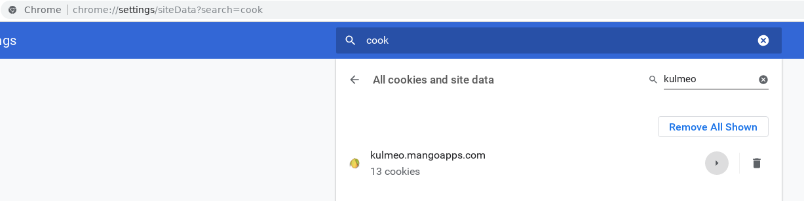
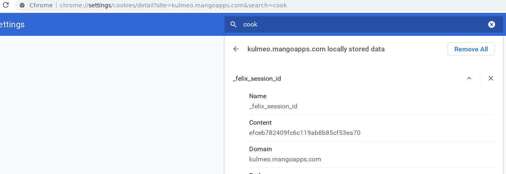
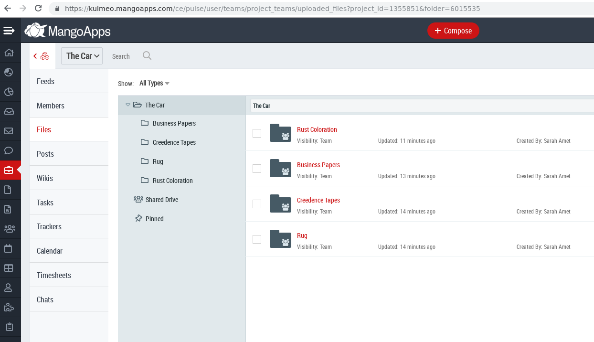

## MangoApps Folder Download (MFD) utility

- what

    - you can use this utility to do a recursive file download of folders in your MangoApps (https://www.mangoapps.com/) account

- why

    - MangoApps limitation

        - "You can download max of 1 Folder and 100 Files at a time"

    - why not write a program in language X to do this because langauge X is Y?

        - i wanted to use common lisp and docker

- how

    - first log into your mangoapps account in a web browser

    - 

    - 

    - 

    - docker run -it --rm  -v /tmp/output:/mnt  mfd ./entry.lisp --cookie "efceb782409fc6c119ab8b85cf53ea70" --folder 6015535

    - docker run -it --rm  -v /tmp/output:/mnt  justin2004/mfd ./entry.lisp --cookie "efceb782409fc6c119ab8b85cf53ea70" --folder 6015535

    - if there are no errors then look in /tmp/output for your files

---

### TODO/notes 

- quicklisp concerns

- show how to run sbcl with more memory (in case you need to download large files)

- it won't attempt to redownload a file that is already there

- show how to get felix_id in chrome

- note why i didn't implement logon

- not tested with filenames with embedded slashes (though outputting to a docker volume should protect your host OS filesystem)
